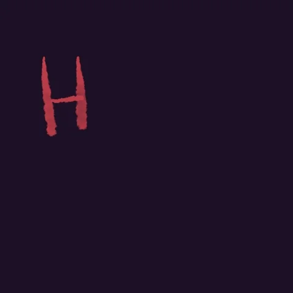

# Solar System



### When I made it :

This project has been created during a workshop about ThreeJS the 6th December 2021.

### What is the purpose :

I played a lot around it, to improve it from my side with all exact distances, sizes and speeds. But our solar system is really big and can't be displayed on a simple browser... So, I adjust some sizes and speed, you can see the modification in the comments of the source code.

### Why I made it :

I pratice ThreeJS to create animation on my Portfolio, to entertain the visitors and to have fun !

### Credits :

Webpack and all the structure is from : Courtesy of Bruno Simon of https://threejs-journey.xyz/

### Setup :

Download [Node.js](https://nodejs.org/en/download/).
Run this followed commands:

```bash
# Install dependencies (only the first time)
npm install

# Run the local server at localhost:8080
npm run dev

# Build for production in the dist/ directory
npm run build
```

#### Workshop presented by [Antoine Lemlin](https://github.com/AntoineLemlin)

#### A big thanks for that entertaining workshop !
